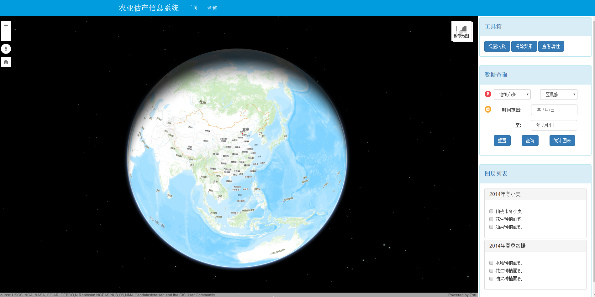
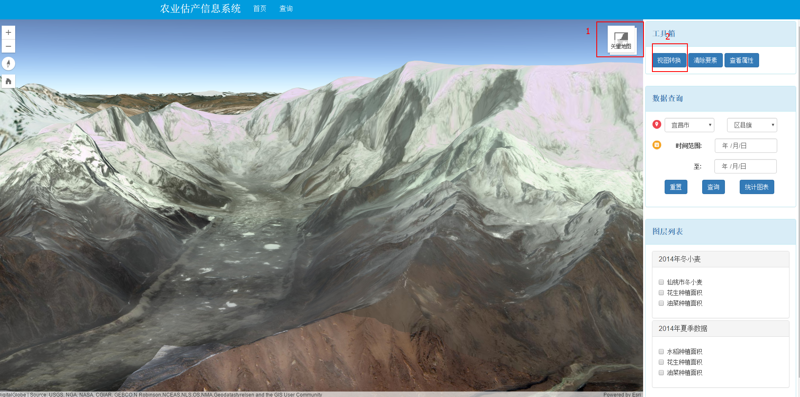
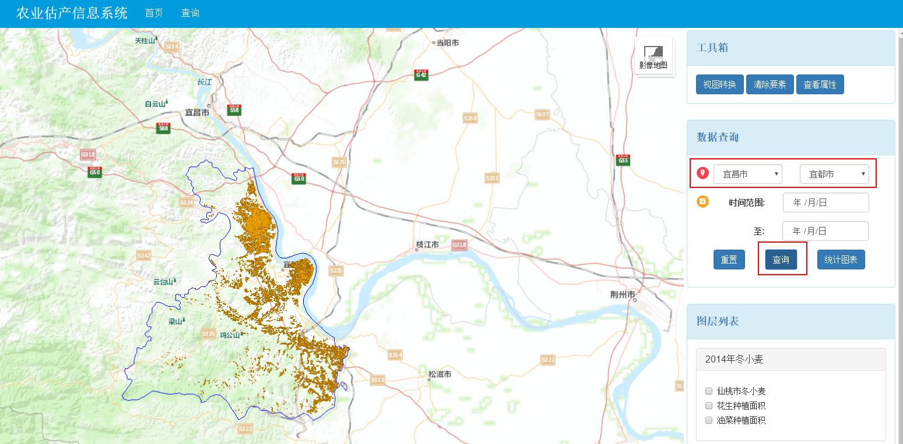
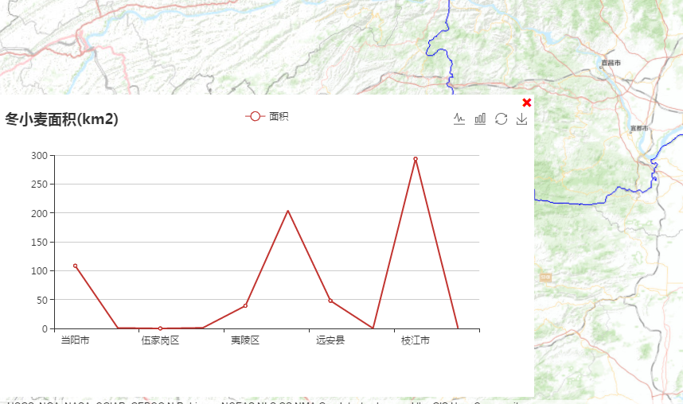
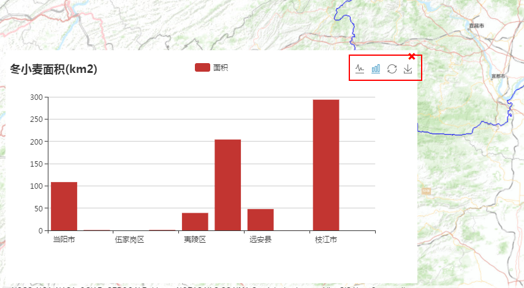

###系统依赖包及JS库文件设置
* 1.本系统NodeJS依赖包配置文件为package.json，在根目录运行npm install即可自行安装依赖包。
* 2.系统依赖的arcgis_js_api由于文件过多并未上传。本系统使用的为arcgis_js_api4.0,可自行前往ArcGIS官网下载，
    下载后解压，将arcgis_js_api文件夹及其子文件放到public/components根目录下，打开arcgis_js_api\library\4.0\4.0\init.js，
    把[HOSTNAME_AND_PATH_TO_JSAPI]替换为localhost:3000/components/arcgis_js_api/library/4.0/4.0/。
    打开arcgis_js_api\library\4.0\4.0\dojo\dojo.js，把[HOSTNAME_AND_PATH_TO_JSAPI]替换为localhost:3000/components/arcgis_js_api/library/4.0/4.0/。即可完成配置
    
###工作进展
2016-7-27：完成图层列表栏图层的添加与删除，实现底图视图控制和图层控制模块的编写，分模块编写功能非常有用，不过有些模块需要访问视图中的layer或者map，这个后面需要考虑在不同模块间这些怎么管理。

###系统界面简介
* 1.系统主界面:左边为地图窗口，右边为功能窗口，地图窗口支持2D或3D视图切换
    
	
    
* 2.功能窗口中能通过行政区划范围查询，查询结果将显示在地图窗口中。
	
* 3.统计功能支持统计所选区域的面积统计，以折线图或柱状图的形式展示。
    
	

  